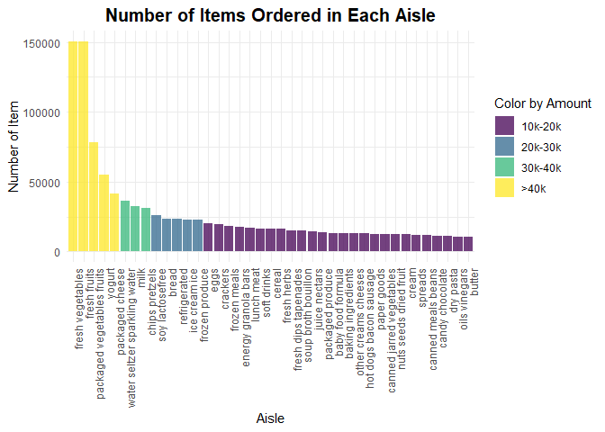
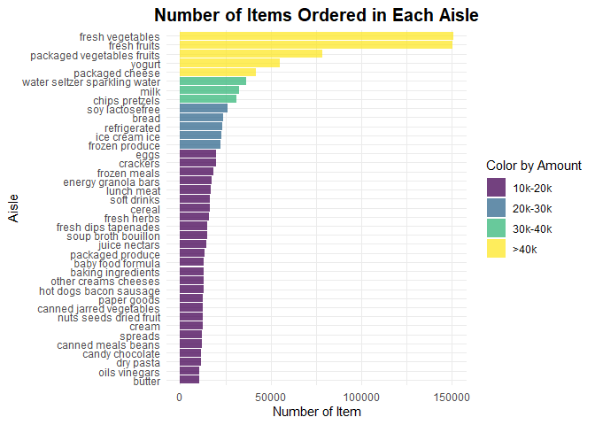

p8105_hw3_yl5508
================
Yifei LIU
2023/10/07

It’s a proj for HW3 about VISUALIZATION AND EDA.

## Problem 1

``` r
#Variables review
data("instacart")
head(instacart, 5)
```

    ## # A tibble: 5 × 15
    ##   order_id product_id add_to_cart_order reordered user_id eval_set order_number
    ##      <int>      <int>             <int>     <int>   <int> <chr>           <int>
    ## 1        1      49302                 1         1  112108 train               4
    ## 2        1      11109                 2         1  112108 train               4
    ## 3        1      10246                 3         0  112108 train               4
    ## 4        1      49683                 4         0  112108 train               4
    ## 5        1      43633                 5         1  112108 train               4
    ## # ℹ 8 more variables: order_dow <int>, order_hour_of_day <int>,
    ## #   days_since_prior_order <int>, product_name <chr>, aisle_id <int>,
    ## #   department_id <int>, aisle <chr>, department <chr>

First, we shall take a quick look at the dataset.  
The `instacart` dataset contains 1384617 obs. and 15 variables. For some
key variables, the delineation for such is shown as below:  
- `order_id` is order identifier, `product_id` is product identifier,
`user_id` is customer identifier. `product_name` is name of the product.
`aisle_id` is aisle identifier. `aisle` is the name of the aisle.
`department_id` is department identifier. `department` is the name of
the department.  
- `reordered`: 1 if this prodcut has been ordered by this user in the
past, 0 otherwise.  
- `order_number` is the order sequence number for this user (1=first,
n=nth).  
- `order_dow` indicates the day of the week on which the order was
placed. `order_hour_of_day` indicates the hour of the day on which the
order was placed.

``` r
#(a)
ins_clean =
  instacart |>
  janitor::clean_names()

#1
ais_num =
  ins_clean |>
  group_by(aisle_id, aisle) |>
  summarise(count = n()) |>
  arrange(desc(count))
head(ais_num, 5)
```

    ## # A tibble: 5 × 3
    ## # Groups:   aisle_id [5]
    ##   aisle_id aisle                       count
    ##      <int> <chr>                       <int>
    ## 1       83 fresh vegetables           150609
    ## 2       24 fresh fruits               150473
    ## 3      123 packaged vegetables fruits  78493
    ## 4      120 yogurt                      55240
    ## 5       21 packaged cheese             41699

``` r
#the same as: 
#2
#ais_num =
  #ins_clean |>
  #group_by(aisle_id, aisle) |>
  #count(aisle, name = "count") |>
  #arrange(-count)
```

**(a)** 134 (or using 134) aisles are existed in data.  
fresh vegetables is aisle that most items ordered from. The amount of
items for this aisle is 150609.

``` r
#(b)
ais_10k =
  ais_num |>
  filter(count > 10000) |>
  mutate(color = ceiling(count / 10000)) |>
  mutate(color = ifelse(color <5, as.character(color), "more"))

ais_10k_vertical =
  ais_10k |>
  ggplot(aes(x = reorder(aisle, -count), y = count, fill = factor(color), color = factor(color))) +
  #reorder ais_10k$aisle according to ais_10k$count. 
  #Actually, it is a factors reorder function, we can use parameter "FUN" to calculate the value in one factor as the reorder criteria.
  #'fill': color the inside, 'color': color the contour.
  geom_bar(stat = "identity", alpha = .75) +
  labs(
    title = "Number of Items Ordered in Each Aisle",
    x = "Aisle",
    y = "Number of Item",
  ) +
  viridis::scale_fill_viridis(discrete = TRUE, option = "viridis") +
  #connected with parameter 'fill'.
  viridis::scale_color_viridis(discrete = TRUE, option = "viridis") +
  #connected with parameter 'color'.
  #or using parameter 'scale_fill_hue(h = c(100, 400)) +'.
  theme_minimal() +
  theme(plot.title = element_text(size = 15, face = "bold", hjust = 0.5), axis.text.x = element_text(angle = 90, hjust = 1), legend.position = "none")
ais_10k_vertical
```

<!-- -->

``` r
ais_10k_horizontal =
  ais_10k |>
  ggplot(aes(x = reorder(aisle, count), y = count, fill = factor(color), color = factor(color))) +
  geom_bar(stat = "identity", alpha = 0.75) +
  labs(
    title = "Number of Items Ordered in Each Aisle",
    x = "Aisle",
    y = "Number of Item",
  ) +
  viridis::scale_fill_viridis(discrete = TRUE, option = "viridis") +
  viridis::scale_color_viridis(discrete = TRUE, option = "viridis") +
  theme_minimal() +
  theme(plot.title = element_text(size = 15, face = "bold", hjust = 0.5), legend.position = "none") +
  coord_flip()
ais_10k_horizontal
```

<!-- -->

``` r
ggsave("ais_10k_vertical.png", ais_10k_vertical)
ggsave("ais_10k_horizontal.png", ais_10k_horizontal)
```

**(b)** Two bar graphs are painted in this part. The data extends in
different directions.  
For the generating process, we filtered the data so that they all lie in
given range. Then we created factors for later coloring process. Use
`ggplot` and `geom_bar` to build graph frameworks. After that, use
function in `viridis` package to color the graphs.

``` r
#(c)
pop_num =
  ins_clean |>
  filter(aisle %in% c("baking ingredients", "dog food care", "packaged vegetables fruits")) |>
  group_by(aisle, product_name) |>
  summarise(count = n()) |>
  arrange(aisle, -count) |>
  top_n(3, wt = count)
pop_num
```

    ## # A tibble: 9 × 3
    ## # Groups:   aisle [3]
    ##   aisle                      product_name                                  count
    ##   <chr>                      <chr>                                         <int>
    ## 1 baking ingredients         Light Brown Sugar                               499
    ## 2 baking ingredients         Pure Baking Soda                                387
    ## 3 baking ingredients         Cane Sugar                                      336
    ## 4 dog food care              Snack Sticks Chicken & Rice Recipe Dog Treats    30
    ## 5 dog food care              Organix Chicken & Brown Rice Recipe              28
    ## 6 dog food care              Small Dog Biscuits                               26
    ## 7 packaged vegetables fruits Organic Baby Spinach                           9784
    ## 8 packaged vegetables fruits Organic Raspberries                            5546
    ## 9 packaged vegetables fruits Organic Blueberries                            4966

**(c)** We filtered the data so that they all lie in given range. Then
we group the data by variables `aisle` and `product_name`. Use
`summarise` to generate the count of specific items given to the
selected groups. At last, `top_n` is used to pick the 3 products with
the biggest count in selected aisles.

``` r
#(d)
ave_h =
  ins_clean |>
  filter(product_name %in% c("Pink Lady Apples", "Coffee Ice Cream")) |>
  group_by(product_name, order_dow) |>
  summarise(ave_hour = mean(order_hour_of_day, na.rm = TRUE)) |>
  pivot_wider(names_from = order_dow, values_from = ave_hour)
ave_h
```

    ## # A tibble: 2 × 8
    ## # Groups:   product_name [2]
    ##   product_name       `0`   `1`   `2`   `3`   `4`   `5`   `6`
    ##   <chr>            <dbl> <dbl> <dbl> <dbl> <dbl> <dbl> <dbl>
    ## 1 Coffee Ice Cream  13.8  14.3  15.4  15.3  15.2  12.3  13.8
    ## 2 Pink Lady Apples  13.4  11.4  11.7  14.2  11.6  12.8  11.9

**(d)** We filtered the data so that they all lie in given range. Then
we group the data by variables `product_name` and `order_dow`. Use
`summarise` to generate the average hour of day given to the selected
groups. At last, `pivot_width` is used to change the table shape, so it
would meet the requirement mentioned in the problem.
