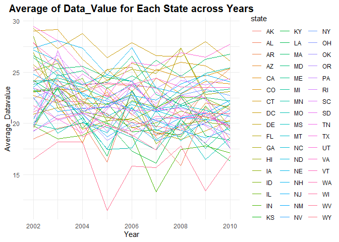
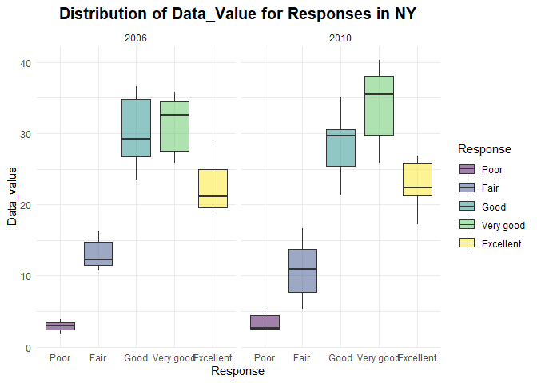

p8105_hw3_yl5508
================
Yifei LIU
2023/10/09

It’s a proj for HW3 about VISUALIZATION AND EDA.

## Problem 1

``` r
#Variables review
data("instacart")
head(instacart, 5)
```

    ## # A tibble: 5 × 15
    ##   order_id product_id add_to_cart_order reordered user_id eval_set order_number
    ##      <int>      <int>             <int>     <int>   <int> <chr>           <int>
    ## 1        1      49302                 1         1  112108 train               4
    ## 2        1      11109                 2         1  112108 train               4
    ## 3        1      10246                 3         0  112108 train               4
    ## 4        1      49683                 4         0  112108 train               4
    ## 5        1      43633                 5         1  112108 train               4
    ## # ℹ 8 more variables: order_dow <int>, order_hour_of_day <int>,
    ## #   days_since_prior_order <int>, product_name <chr>, aisle_id <int>,
    ## #   department_id <int>, aisle <chr>, department <chr>

First, we shall take a quick look at the dataset.  
The `instacart` dataset contains 1384617 obs. and 15 variables. For some
key variables, the delineation for such is shown as below:  
- `order_id` is order identifier, `product_id` is product identifier,
`user_id` is customer identifier. `product_name` is name of the product.
`aisle_id` is aisle identifier. `aisle` is the name of the aisle.
`department_id` is department identifier. `department` is the name of
the department.  
- `reordered`: 1 if this prodcut has been ordered by this user in the
past, 0 otherwise.  
- `order_number` is the order sequence number for this user (1=first,
n=nth).  
- `order_dow` indicates the day of the week on which the order was
placed. `order_hour_of_day` indicates the hour of the day on which the
order was placed.

``` r
#(a)
ins_clean =
  instacart |>
  janitor::clean_names()

#1
ais_num =
  ins_clean |>
  group_by(aisle_id, aisle) |>
  summarise(count = n()) |>
  arrange(desc(count))
head(ais_num, 5)
```

    ## # A tibble: 5 × 3
    ## # Groups:   aisle_id [5]
    ##   aisle_id aisle                       count
    ##      <int> <chr>                       <int>
    ## 1       83 fresh vegetables           150609
    ## 2       24 fresh fruits               150473
    ## 3      123 packaged vegetables fruits  78493
    ## 4      120 yogurt                      55240
    ## 5       21 packaged cheese             41699

``` r
#the same as: 
#2
#ais_num =
  #ins_clean |>
  #group_by(aisle_id, aisle) |>
  #count(aisle, name = "count") |>
  #arrange(-count)
```

**(a)** 134 (or using 134) aisles are existed in data.  
fresh vegetables is aisle that most items ordered from. The amount of
items for this aisle is 150609.

``` r
#(b)
ais_10k =
  ais_num |>
  filter(count > 10000) |>
  mutate(color = ceiling(count / 10000)) |>
  mutate(color = ifelse(color <5, as.character(color), "more"))

ais_10k_vertical =
  ais_10k |>
  ggplot(aes(x = reorder(aisle, -count), y = count, fill = factor(color), color = factor(color))) +
  #reorder ais_10k$aisle according to ais_10k$count. 
  #Actually, it is a factors reorder function, we can use parameter "FUN" to calculate the value in one factor as the reorder criteria.
  #'fill': color the inside, 'color': color the contour.
  geom_bar(stat = "identity", alpha = .75) +
  labs(
    title = "Number of Items Ordered in Each Aisle",
    x = "Aisle",
    y = "Number of Item",
  ) +
  viridis::scale_fill_viridis(discrete = TRUE, option = "viridis") +
  #connected with parameter 'fill'.
  viridis::scale_color_viridis(discrete = TRUE, option = "viridis") +
  #connected with parameter 'color'.
  #or using parameter 'scale_fill_hue(h = c(100, 400)) +'.
  theme_minimal() +
  theme(plot.title = element_text(size = 15, face = "bold", hjust = 0.5), axis.text.x = element_text(angle = 90, hjust = 1), legend.position = "none")
ais_10k_vertical
```

<!-- -->

``` r
ais_10k_horizontal =
  ais_10k |>
  ggplot(aes(x = reorder(aisle, count), y = count, fill = factor(color), color = factor(color))) +
  geom_bar(stat = "identity", alpha = 0.75) +
  labs(
    title = "Number of Items Ordered in Each Aisle",
    x = "Aisle",
    y = "Number of Item",
  ) +
  viridis::scale_fill_viridis(discrete = TRUE, option = "viridis") +
  viridis::scale_color_viridis(discrete = TRUE, option = "viridis") +
  theme_minimal() +
  theme(plot.title = element_text(size = 15, face = "bold", hjust = 0.5), legend.position = "none") +
  coord_flip()
ais_10k_horizontal
```

<!-- -->

``` r
ggsave("ais_10k_vertical.png", ais_10k_vertical)
ggsave("ais_10k_horizontal.png", ais_10k_horizontal)
```

**(b)** Two bar graphs are painted in this part. The data extends in
different directions.  
For the generating process, we filtered the data so that they all lie in
given range. Then we created factors for later coloring process. Use
`ggplot` and `geom_bar` to build graph frameworks. After that, use
function in `viridis` package to color the graphs.

``` r
#(c)
pop_num =
  ins_clean |>
  filter(aisle %in% c("baking ingredients", "dog food care", "packaged vegetables fruits")) |>
  group_by(aisle, product_name) |>
  summarise(count = n()) |>
  arrange(aisle, -count) |>
  top_n(3, wt = count)
pop_num
```

    ## # A tibble: 9 × 3
    ## # Groups:   aisle [3]
    ##   aisle                      product_name                                  count
    ##   <chr>                      <chr>                                         <int>
    ## 1 baking ingredients         Light Brown Sugar                               499
    ## 2 baking ingredients         Pure Baking Soda                                387
    ## 3 baking ingredients         Cane Sugar                                      336
    ## 4 dog food care              Snack Sticks Chicken & Rice Recipe Dog Treats    30
    ## 5 dog food care              Organix Chicken & Brown Rice Recipe              28
    ## 6 dog food care              Small Dog Biscuits                               26
    ## 7 packaged vegetables fruits Organic Baby Spinach                           9784
    ## 8 packaged vegetables fruits Organic Raspberries                            5546
    ## 9 packaged vegetables fruits Organic Blueberries                            4966

**(c)** We filtered the data so that they all lie in given range. Then
we group the data by variables `aisle` and `product_name`. Use
`summarise` to generate the count of specific items given to the
selected groups. At last, `top_n` is used to pick the 3 products with
the biggest count in selected aisles.

``` r
#(d)
ave_h =
  ins_clean |>
  filter(product_name %in% c("Pink Lady Apples", "Coffee Ice Cream")) |>
  group_by(product_name, order_dow) |>
  summarise(ave_hour = mean(order_hour_of_day, na.rm = TRUE)) |>
  pivot_wider(names_from = order_dow, values_from = ave_hour)
ave_h
```

    ## # A tibble: 2 × 8
    ## # Groups:   product_name [2]
    ##   product_name       `0`   `1`   `2`   `3`   `4`   `5`   `6`
    ##   <chr>            <dbl> <dbl> <dbl> <dbl> <dbl> <dbl> <dbl>
    ## 1 Coffee Ice Cream  13.8  14.3  15.4  15.3  15.2  12.3  13.8
    ## 2 Pink Lady Apples  13.4  11.4  11.7  14.2  11.6  12.8  11.9

**(d)** We filtered the data so that they all lie in given range. Then
we group the data by variables `product_name` and `order_dow`. Use
`summarise` to generate the average hour of day given to the selected
groups. At last, `pivot_width` is used to change the table shape, so it
would meet the requirement mentioned in the problem.

## Problem 2

``` r
#Variables review
data("brfss_smart2010")
head(brfss_smart2010, 5)
```

    ## # A tibble: 5 × 23
    ##    Year Locationabbr Locationdesc      Class Topic Question Response Sample_Size
    ##   <int> <chr>        <chr>             <chr> <chr> <chr>    <chr>          <int>
    ## 1  2010 AL           AL - Jefferson C… Heal… Over… How is … Excelle…          94
    ## 2  2010 AL           AL - Jefferson C… Heal… Over… How is … Very go…         148
    ## 3  2010 AL           AL - Jefferson C… Heal… Over… How is … Good             208
    ## 4  2010 AL           AL - Jefferson C… Heal… Over… How is … Fair             107
    ## 5  2010 AL           AL - Jefferson C… Heal… Over… How is … Poor              45
    ## # ℹ 15 more variables: Data_value <dbl>, Confidence_limit_Low <dbl>,
    ## #   Confidence_limit_High <dbl>, Display_order <int>, Data_value_unit <chr>,
    ## #   Data_value_type <chr>, Data_Value_Footnote_Symbol <chr>,
    ## #   Data_Value_Footnote <chr>, DataSource <chr>, ClassId <chr>, TopicId <chr>,
    ## #   LocationID <chr>, QuestionID <chr>, RESPID <chr>, GeoLocation <chr>

First, we shall take a quick look at the dataset.  
The `brfss` dataset contains 134203 obs. and 23 variables. For some key
variables, the delineation for such is shown as below:  
- `year` is the time when data is recorded.  
- `Locationabbr` is abbreviation of states.  
- `Locationdesc` is abbreviation of detailed location.  
- `Class` and `Topic` are the type of questions. `Response` is how
subjects respond to the `Question`.  
- Other variables are concerned with the statistic analysis result and
info about the answers.

``` r
health_clean =
  brfss_smart2010 |>
  janitor::clean_names() |>
  select(state = locationabbr, location = locationdesc, everything()) |>
  filter(topic == "Overall Health") |>
  filter(response %in% c("Excellent", "Very good", "Good", "Fair", "Poor")) |>
  mutate(response = factor(response, levels = c("Poor", "Fair", "Good", "Very good", "Excellent"), ordered = TRUE)) |>
  arrange(response, year, state, location)
  #the same as: arrange(factor(response, levels = c("Poor", "Fair", "Good", "Very good", "Excellent"), ordered = TRUE), state, specific_location, year)
head(health_clean, 5)
```

    ## # A tibble: 5 × 23
    ##   state location       year class topic question response sample_size data_value
    ##   <chr> <chr>         <int> <chr> <chr> <chr>    <ord>          <int>      <dbl>
    ## 1 AK    AK - Anchora…  2002 Heal… Over… How is … Poor              22        5.9
    ## 2 AL    AL - Jeffers…  2002 Heal… Over… How is … Poor              31        5.9
    ## 3 AR    AR - Pulaski…  2002 Heal… Over… How is … Poor              25        4.2
    ## 4 AZ    AZ - Maricop…  2002 Heal… Over… How is … Poor              39        4.6
    ## 5 AZ    AZ - Pima Co…  2002 Heal… Over… How is … Poor              31        3.9
    ## # ℹ 14 more variables: confidence_limit_low <dbl>, confidence_limit_high <dbl>,
    ## #   display_order <int>, data_value_unit <chr>, data_value_type <chr>,
    ## #   data_value_footnote_symbol <chr>, data_value_footnote <chr>,
    ## #   data_source <chr>, class_id <chr>, topic_id <chr>, location_id <chr>,
    ## #   question_id <chr>, respid <chr>, geo_location <chr>

``` r
hea_02 =
  health_clean |>
  filter(year == "2002") |>
  group_by(state) |>
  summarise(count = n_distinct(location)) |>
  filter(count >= 7)
hea_02 |> pull(state)
```

    ## [1] "CT" "FL" "MA" "NC" "NJ" "PA"

``` r
hea_10 =
  health_clean |>
  filter(year == "2010") |>
  group_by(state) |>
  summarise(count = n_distinct(location)) |>
  filter(count >= 7)
hea_10 |> pull(state)
```

    ##  [1] "CA" "CO" "FL" "MA" "MD" "NC" "NE" "NJ" "NY" "OH" "PA" "SC" "TX" "WA"

In **2002**, states which were observed at 7 or more location are shown
as followed: CT, FL, MA, NC, NJ, PA.  
In **2010**, states which were observed at 7 or more location are shown
as followed: CT, FL, MA, NC, NJ, PA.

``` r
exc_hea_data =
  health_clean |>
  filter(response == "Excellent") |>
  group_by(year, state) |>
  summarise(ave_dv = mean(data_value, na.rm = TRUE))

exc_hea_data |>
  ggplot(aes(x = year, y = ave_dv, group = state, color = state)) +
  geom_line() +
  labs(
    title = "Average of Data_Value for Each State across Years",
    x = "Year",
    y = "Average_Datavalue",
  ) +
  theme_minimal() +
  theme(plot.title = element_text(size = 15, face = "bold", hjust = 0.5), legend.position = "right")
```

<!-- -->

We take `health_clean` dataset as original data, and group the data up
by variables `year` and `state`. Then, use `summarise()` to get the
average of `data_vale` across locations within a state. At last, a
spaghetti plot is drawn from the dataset manipulated using methods as
mentioned above.

``` r
health_clean |>
  filter(year == "2006" | year == "2010") |>
  filter(state == "NY") |>
  ggplot(aes(x = response, y = data_value)) +
  geom_boxplot() +
  labs(
    title = "Distribution of Data_Value for Responses in NY",
    x = "Response",
    y = "Data_value",
  ) +
  theme(plot.title = element_text(size = 15, face = "bold", hjust = 0.5)) +
  facet_grid(~year)
```

<!-- -->

``` r
#basically the same as:
res_hea_06 =
  health_clean |>
  filter(year == "2006" & state == "NY") |>
  ggplot(aes(x = response, y = data_value)) +
  geom_boxplot() +
  theme(legend.position = "none")

res_hea_10 =
  health_clean |>
  filter(year == "2010" & state == "NY") |>
  ggplot(aes(x = response, y = data_value)) +
  geom_boxplot() +
  theme(legend.position = "none")

library(patchwork)
res_hea_06 + res_hea_10
```

Picture a plot with two panels using data filtered by variables `year`
and `state` from dataset `health_clean`. We pick boxplot to show the
distribution of `data_value`.
